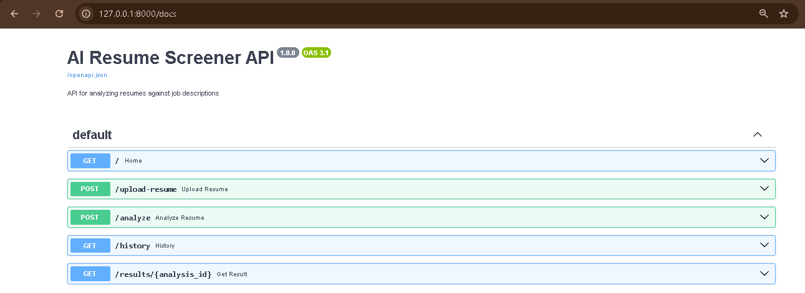

# AI Resume Screener API

A backend API that analyzes a resume against a job description and calculates a similarity score using Natural Language Processing (NLP).

The system extracts text from PDF resumes, compares the resume with a job description using TF-IDF and cosine similarity, identifies matching and missing skills, and stores analysis results in SQLite.

## Features

- Upload PDF resumes
- Extract text from PDF files
- Compare resumes with job descriptions
- Calculate resume-job similarity score
- Identify matching skills
- Identify missing skills
- Store analysis results using SQLite
- View analysis history
- Retrieve individual analysis results
- Input validation and error handling
- Interactive API documentation using Swagger UI

## Technologies Used

- Python
- FastAPI
- Uvicorn
- scikit-learn
- TF-IDF
- Cosine Similarity
- pypdf
- SQLite
- REST API

## How It Works

```text
PDF Resume
    ↓
Text Extraction
    ↓
Resume Text + Job Description
    ↓
TF-IDF Vectorization
    ↓
Cosine Similarity
    ↓
Match Score
    ↓
Skill Matching
    ↓
SQLite Database
    ↓
Analysis Result

## Swagger UI

The API provides interactive documentation using Swagger UI.

